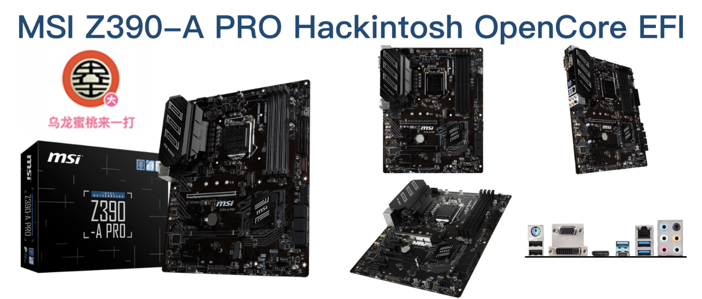

## 微星 Z390-A PRO 黑苹果 OpenCore EFI




### [ENGLISH](README.EN.md)

### OpenCore

[OpenCore 0.9.3](https://github.com/acidanthera/OpenCorePkg)

### macOS

- macOS Monterey 12.x
- macOS Ventura  13.x 

### 硬件

- 芯片组: Z390
- Bios 版本:E7B98IMS.110（2018-08-22）
- 处理器: 英特尔9代 i7-9700K
- 内存: 英睿达 8G*2 DDR4 2666MHz
- 硬盘: 爱国者 S500 512G MacOS
- 核显: 英特尔超核心显卡630
- 独显: 戴尔 AMD RX580X 8G 2304SP
- 声卡: 瑞昱ALC892
- 有线网卡: 英特尔 L219-V
- 无线网卡: BCM94360CS2

### BIOS设置

```
SETTINGS
  |-- 高级
     |-- 内建显示设置
        |-- 集成多显卡显示：允许
		|-- 集显共享内存：64MB
	 |-- USB设置
		|-- XHCI Hand-off：允许
	 |-- 超级IO配置
		|-- 串口IO配置
	       |-- Serial Port：禁止
	    |-- 平行（LPT）端口配置
		   |-- 并口：禁止
	 |-- 唤醒事件设置
	    |-- 唤醒事件管理：BIOS
   |-- 启动	
	 |-- 启动模式选择：UEFI

OC
  |-- CPU 特征
     |-- CFG 锁定：禁止
	 |-- SW Guard Extensions(SGX)：禁止
		
Search：secure
  |-- 安全启动：关闭

```

### 注意事项

 - 安装成功后必须使用 [OpenCore Configurator](https://mackie100projects.altervista.org/opencore-configurator/) 或者 [OCAuxiliaryTools](https://github.com/ic005k/OCAuxiliaryTools) 生成你自己的 SMBIOS


### 联系我们

QQ群: 23304408


### 常用工具

- [Hackintool](https://github.com/headkaze/Hackintool) 
- [OCAuxiliaryTools](https://github.com/ic005k/OCAuxiliaryTools) AKA `OCAT`.
- [OpenCore Configurator](https://mackie100projects.altervista.org/opencore-configurator/) AKA `OCC`.
- [gibMacOS](https://github.com/corpnewt/gibMacOS) Build your own MacOS image.
- [ProperTree](https://github.com/corpnewt/ProperTree) Plist editor.